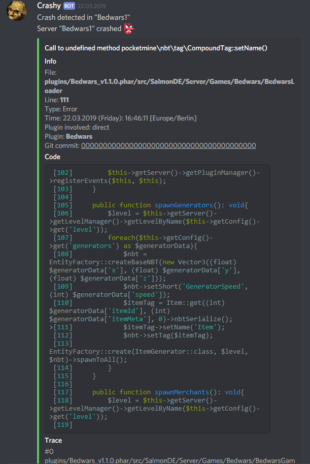

# CrashLogger

This plugin allows you to keep track of server crashes in a discord channel and optionally removes old crash dumps.

### **Requirements:**
- A webhook url from discord
- An internet connection

## **Discord Preview**:

